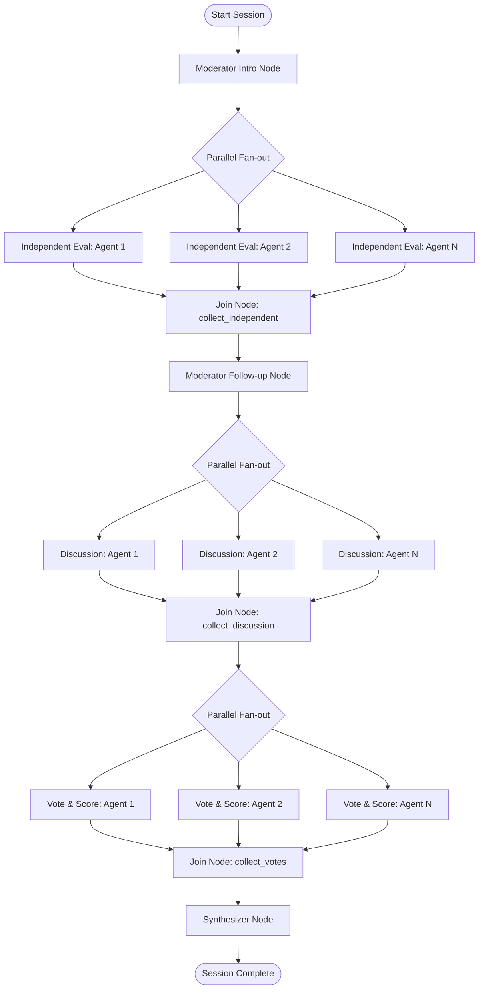

# Developer Guidelines for AI Agents

Welcome to the **AI Focus Group** codebase. This guide outlines key patterns, architectures, and requirements to follow when extending or modifying this project.

---

## 🛠️ Stack & Technologies

- **Backend**:
  - Python 3.11+
  - **FastAPI**: Main API framework with Server-Sent Events (SSE) streaming support.
  - **Google ADK (Agent Development Kit)**: Orchestrates the parallel agent workflow graph.
  - **Google GenAI SDK**: Communicates with `gemini-2.5-pro` (moderation & synthesis) and `gemini-2.5-flash` (participants).
- **Frontend**:
  - **Next.js 16** & **React 19**
  - **Tailwind CSS v4**: Utility-first CSS styling.
  - **TypeScript**: Standard type definitions.
  - **jsPDF** & **docx**: Client-side document export libraries.

---

## 🏗️ System Architecture

The workflow uses Google ADK to coordinate the focus group discussion. The workflow graph is designed around parallel execution nodes (fan-out) and coordination nodes (fan-in):



---

## 🐍 Backend Guidelines (`/backend`)

### 1. Google ADK Workflows
- Define workflow nodes using the `@node` decorator.
- Use `JoinNode` for fan-in points to gather results from parallel tasks.
- Capture loop variables properly (e.g. using `_p=p` default arguments in lambda or nested functions) when dynamically creating participant nodes.
- Maintain session state inside the ADK session: `session.state = dict(initial_state)`.

### 2. GenAI Clients
- Always use the new `google-genai` SDK:
  ```python
  from google import genai
  client = genai.Client()
  ```
- Use async calls for model invocation (`await client.aio.models.generate_content(...)`).
- Use structured JSON outputs by specifying `response_mime_type="application/json"` and `response_schema=YourPydanticModel` in `GenerateContentConfig`.

### 3. State Management & SSE
- The backend uses Server-Sent Events (SSE) via `sse-starlette` to stream state updates dynamically.
- Store session data in `backend/api/sessions.py`'s `_sessions` in-memory store.
- Append incremental updates to the `stream_events` list inside the session state.
- Ensure endpoints handle SSE reconnections gracefully by replaying past events.

---

## ⚛️ Frontend Guidelines (`/frontend`)

### 1. React & Next.js Conventions
- **Next.js 16**: Uses the App Router (`app/` directory).
- **React 19**: Strictly adhere to React 19 conventions. Use React hooks like `useCallback` and `useRef` correctly.
- Mark client-interactive components with `"use client"`.

### 2. Styling (Tailwind CSS v4)
- Keep CSS clean. Custom styles and variables are located in `frontend/app/globals.css`.
- Avoid arbitrary Tailwind values where custom utilities or standard theme values can be used.

### 3. Server-Sent Events (SSE) Client
- The SSE connection is managed by `frontend/app/hooks/useFocusGroup.ts`.
- It processes events of type `phase_change`, `agent_message`, `score_update`, `report_complete`, and `done`.
- Once the stream sends `done`, the hook fetches the full session state from the GET endpoint to populate `final_report`.

---

## 🔧 Dev & Run Commands

### Backend
- Run backend locally:
  ```bash
  cd backend
  uvicorn main:app --reload
  ```
- Install dependencies:
  ```bash
  cd backend
  pip install -r requirements.txt
  ```

### Frontend
- Run development server:
  ```bash
  cd frontend
  npm run dev
  ```
- Run linting:
  ```bash
  cd frontend
  npm run lint
  ```
- Build production bundle:
  ```bash
  cd frontend
  npm run build
  ```
