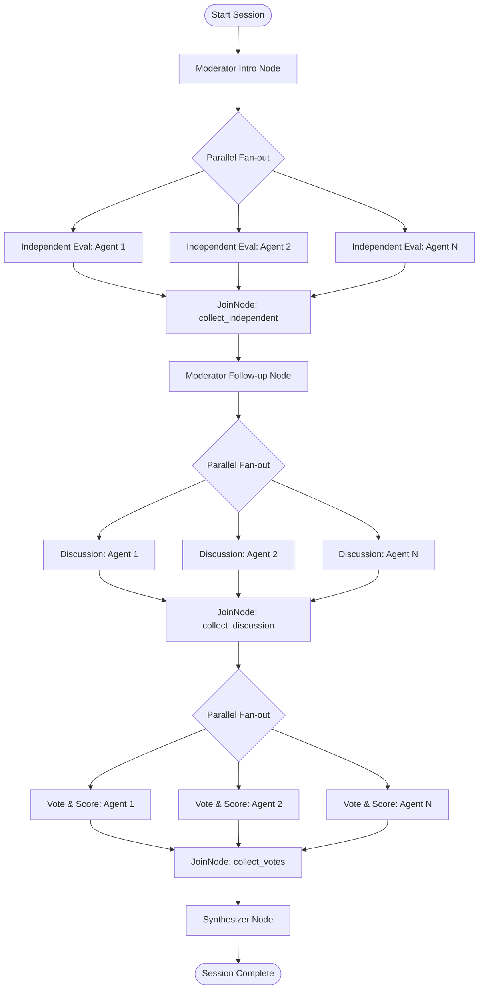

<!-- generated-by: gsd-doc-writer -->
# Developer Guidelines for AI Agents

Welcome to the **Synthetic Market Intelligence Platform (AI Focus Group)** codebase. This guide outlines key patterns, architectures, and requirements to follow when extending or modifying this project.

---

## Stack & Technologies

### Backend
- **Python 3.11+**
- **FastAPI** (`>=0.115.0`): Main API framework with SSE streaming via `sse-starlette`.
- **Google ADK** (`google-adk>=2.0.0`): Orchestrates the parallel agent workflow graph via `google.adk.workflow`.
- **Google GenAI SDK** (`google-genai>=0.1.0`): Communicates with `gemini-2.5-pro` (moderator and synthesizer nodes) and `gemini-2.5-flash` (participant nodes).
- **Pydantic** (`>=2.8.0`): Request/response validation and structured output schemas.
- **python-dotenv**: Loads `backend/.env` for `GEMINI_API_KEY`.

### Frontend
- **Flutter Web** (Dart SDK `^3.11.5`): All UI code lives in `frontend/`.
- **Riverpod** (`flutter_riverpod ^3.3.2`): The sole state management solution.
- **`package:web` + `dart:js_interop`**: Browser-native `EventSource` for SSE.
- **`pdf` + `printing`**: Client-side PDF report export (`pdf_builder.dart`).
- **`archive`**: Client-side DOCX report export via hand-rolled OOXML (`docx_builder.dart`).

---

## System Architecture

The workflow uses Google ADK to coordinate the focus group discussion. The graph is designed around parallel fan-out nodes (participants running concurrently) and fan-in `JoinNode` checkpoints.



---

## Backend Guidelines (`backend/`)

### 1. Google ADK Workflows

- Define workflow nodes using the `@node` decorator (from `google.adk.workflow`).
- Use `JoinNode` for fan-in points to gather results from parallel tasks.
- Capture loop variables properly with default arguments when dynamically creating participant nodes:
  ```python
  for p in participants:
      @node(name=f"independent_{p['id']}", rerun_on_resume=True)
      async def indep_node(ctx: Context, node_input: Any, _p=p):
          res = await make_independent_response(ctx, ctx.state, _p)
          return Event(output=res, state=res)
  ```
- Maintain session state inside the ADK runner: `await runner.session_service.create_session(..., state=dict(initial_state))`.
- Build the graph with `build_graph(participants)` in `backend/agents/graph.py`.

### 2. GenAI Clients

Always use the `google-genai` SDK:

```python
from google import genai
client = genai.Client()
```

- Use async calls: `await client.aio.models.generate_content(...)`.
- Use structured JSON output by specifying `output_schema=YourPydanticModel` on `LlmAgent`.
- Moderator and synthesizer nodes use `model="gemini-2.5-pro"`; participant nodes use `model="gemini-2.5-flash"`.

### 3. State Management & SSE

- Session data lives in `backend/api/sessions.py`'s `_sessions` in-memory dict.
- The background task `_run_session` streams node outputs and merges them into `_sessions[session_id]` incrementally.
- `stream_events` and `citations` lists are appended (not replaced); dict fields like `independent_responses`, `discussion_responses`, and `scores` are merged with `{**current, **new}`.
- The SSE endpoint replays the full `stream_events` list on every client connection — do not implement manual reconnect logic on the frontend.

### 4. Plugins

**Blue Team** (`backend/plugins/blue_team_plugin.py`):
- Extends `BasePlugin` with an `after_tool_callback`.
- Tracks per-node tool calls in `state["agbom_per_node"]`.
- Threshold: `MAX_TOOLS_PER_NODE = 10`. Each excess call deducts 25 from `state["trust_score"]` (floor 0).
- When `trust_score < 50`, sets `state["quarantine_flag"] = True`.

**Green Team** (`backend/plugins/green_team_plugin.py`):
- Extends `BasePlugin` with a `before_tool_callback`.
- If `state["quarantine_flag"]` is `True`, raises `RuntimeError` to halt all further tool execution for that session (stateful quarantine).

### 5. Personas

Five personas are defined in `backend/agents/personas.py`:

| ID | Name | Role |
|----|------|------|
| `skeptical_investor` | Marcus Chen | Skeptical Investor |
| `early_adopter` | Zoe Park | Enthusiastic Early Adopter |
| `enterprise_cto` | David Okafor | Enterprise CTO |
| `ux_researcher` | Priya Sharma | UX Researcher |
| `growth_marketer` | Jordan Ellis | Growth Marketer |

Each persona has `temperature`, `communication_style`, `scoring_weights`, `personality`, `expertise`, `biases`, and `hidden_motivation` fields.

### 6. Key Backend Files

| File | Purpose |
|------|---------|
| `backend/main.py` | FastAPI app, CORS config (allows `localhost:8080` for Flutter) |
| `backend/api/sessions.py` | Session CRUD, background workflow runner, in-memory store |
| `backend/api/stream.py` | SSE streaming endpoint |
| `backend/agents/graph.py` | ADK workflow graph builder |
| `backend/agents/personas.py` | 5 persona definitions |
| `backend/agents/nodes/moderator.py` | Moderator intro and follow-up nodes (gemini-2.5-pro) |
| `backend/agents/nodes/participant.py` | Independent, discussion, and vote nodes (gemini-2.5-flash) |
| `backend/agents/nodes/synthesizer.py` | Synthesizer node (gemini-2.5-pro + google_search) |
| `backend/plugins/blue_team_plugin.py` | AGBOM tracking, trust scoring |
| `backend/plugins/green_team_plugin.py` | Quarantine gate |

---

## Frontend Guidelines (`frontend/`)

### 1. State Management (Riverpod)

- Use **Riverpod only** for state management. Do not introduce ad-hoc `setState` or `InheritedWidget` patterns.
- The primary state machine is `SessionNotifier` (a `Notifier<FocusGroupState>`) in `frontend/lib/state/session_notifier.dart`.
- Expose it via `sessionProvider` (`NotifierProvider<SessionNotifier, FocusGroupState>`).
- All SSE event folding, session start, and reset logic must go through `SessionNotifier`. Widgets read state only.

### 2. SSE Client

- SSE is consumed via `SseConnection` in `frontend/lib/data/sse_client.dart`.
- It wraps the browser's native `EventSource` using `package:web` and `dart:js_interop`.
- **One connection per session, no manual reconnect.** The backend replays the full event history on every connect.
- Call `_sse?.close()` immediately on receiving a `done` or `error` event.

### 3. REST Client

- All REST calls go through `ApiClient` in `frontend/lib/data/api_client.dart`.
- The base URL is configured via `--dart-define=API_BASE=http://localhost:8000` at build/run time and read from `frontend/lib/app/config.dart`.
- Do not make `http` calls directly in widgets or notifiers — use `ApiClient` methods.

### 4. Data Models

- Models are hand-written with `fromJson` in `frontend/lib/models/`.
- `StreamEvent` fields `agent_id`, `agent_name`, and `scores` are **nullable** because `done` and `error` events omit them.
- Do not replace hand-written models with code-generation (e.g., `json_serializable`) without updating all `fromJson` call sites.

### 5. Export

Both export formats must remain working:

| File | Package | Output |
|------|---------|--------|
| `frontend/lib/export/pdf_builder.dart` | `pdf` + `printing` | PDF report |
| `frontend/lib/export/docx_builder.dart` | `archive` (hand-rolled OOXML) | DOCX report |

Do not remove or stub out either export path.

### 6. Key Frontend Files

| File | Purpose |
|------|---------|
| `frontend/lib/state/session_notifier.dart` | `SessionNotifier` — all session state and SSE event folding |
| `frontend/lib/data/sse_client.dart` | `SseConnection` wrapping browser `EventSource` |
| `frontend/lib/data/api_client.dart` | REST client (`ApiClient`) |
| `frontend/lib/app/config.dart` | `apiBaseUrl` from `--dart-define=API_BASE` |
| `frontend/lib/models/` | Hand-written `fromJson` data models |
| `frontend/lib/export/pdf_builder.dart` | PDF export (`buildPdf`) |
| `frontend/lib/export/docx_builder.dart` | DOCX export |

---

## Dev & Run Commands

### Backend

Install dependencies (uses the project virtualenv — required for `google-adk>=2.0.0`):

```bash
backend/.venv/bin/pip install -r backend/requirements.txt
```

Run the backend (must be run from the **repo root**, not from `backend/`):

```bash
backend/.venv/bin/uvicorn backend.main:app --reload --port 8000
```

> `main.py` uses package-relative imports (`from .api.sessions import ...`), so `cd backend && uvicorn main:app` fails with "attempted relative import with no known parent package".

Copy and configure environment:

```bash
cp backend/.env.example backend/.env
# Add GEMINI_API_KEY to backend/.env
```

### Frontend

Install dependencies:

```bash
cd frontend && flutter pub get
```

Run the development server (Chrome, port 8080):

```bash
cd frontend && flutter run -d chrome --web-port=8080 --dart-define=API_BASE=http://localhost:8000
```

> The backend CORS allowlist permits `http://localhost:8080`. Keep the Flutter web port at 8080.

Analyze:

```bash
cd frontend && flutter analyze
```

Test:

```bash
cd frontend && flutter test
```

Build production bundle:

```bash
cd frontend && flutter build web --dart-define=API_BASE=http://localhost:8000
```
