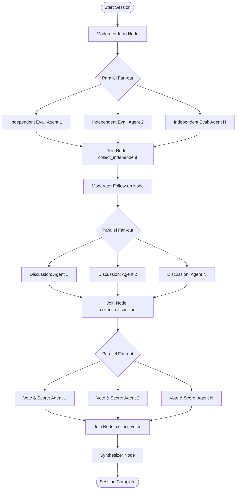

<!-- generated-by: gsd-doc-writer -->
# Synthetic Market Intelligence Platform

A synthetic research panel powered by role-based AI agents. Submit any idea, product, or concept and watch a structured panel of distinct AI personas debate, critique, score, and synthesize it — in real time.


## What It Does

Instead of asking a single AI "what do you think?", this platform convenes a panel of five opinionated agents, each with a unique background, bias set, hidden motivation, and scoring lens. They run through a structured discussion protocol:

1. **Independent evaluation** — each agent reacts without seeing the others' responses (prevents groupthink)
2. **Moderated follow-up** — a Moderator agent surfaces disagreements and asks targeted follow-up questions
3. **Open discussion** — participants respond to each other's critiques
4. **Blind voting** — each agent scores the idea privately across six dimensions
5. **Synthesis** — a dedicated Synthesizer agent reads the full discussion and produces an executive report
6. **Report Export** — export the generated executive report as PDF or DOCX directly from the UI

The result is far more useful than a single AI opinion: you get structured disagreement, diverse risk analysis, a consensus score, and actionable recommendations.

---

## Workflow and Architecture

The application orchestrates a structured research study using parallel and sequential agent nodes defined via the **Google ADK** workflow graph:



---

## Personas

| Name | Role | Hidden Motivation |
|------|------|-------------------|
| Marcus Chen | Skeptical Investor | Find the fatal flaw before anyone else does |
| Zoe Park | Enthusiastic Early Adopter | Be first to discover the next big thing |
| David Okafor | Enterprise CTO | Protect against vendor lock-in and technical debt |
| Priya Sharma | UX Researcher | Ensure real users can use this without a manual |
| Jordan Ellis | Growth Marketer | Find the distribution wedge that makes this explode |

Each persona has its own personality traits, expertise domain, known biases, LLM temperature, and weighted scoring criteria. Sessions accept 1–5 participants.

---

## Scoring Dimensions

Each participant scores the idea across six categories, weighted by their persona:

- **Innovation** — how novel and differentiated
- **Market Potential** — size, timing, and competitive dynamics
- **UX** — usability and user experience quality
- **Feasibility** — technical complexity and execution risk
- **Monetization** — revenue model clarity and sustainability
- **Risk** — downside exposure and failure modes

The Synthesizer aggregates scores into an overall viability rating plus a standard deviation that signals how much consensus (or healthy disagreement) exists.

---

## Agent Security

Two ADK plugins run on every session:

- **BlueTeamAnalyticsPlugin** — tracks per-node tool call counts (Agent BOM). If a single workflow node exceeds 10 tool calls, it deducts 25 points from the session Trust Score and flags potential Intent Drift.
- **GreenTeamQuarantinePlugin** — enforces a Stateful Quarantine when Trust Score falls below 50: blocks further tool execution while preserving session state for forensic analysis.

Set `security_test_mode: true` in the session creation request to exercise these defenses.

---

## Stack

**Backend**
- Python 3.11+
- [FastAPI](https://fastapi.tiangolo.com/) — REST API + SSE streaming via `sse-starlette`
- [Google ADK](https://adk.dev/) `>=2.0.0` — multi-agent workflow orchestration with parallel fan-out
- [Google GenAI](https://pypi.org/project/google-genai/) — Gemini 2.5 Pro (Moderator and Synthesizer) and Gemini 2.5 Flash (Participants)
- [Pydantic](https://docs.pydantic.dev/) `>=2.8` — request/response validation

**Frontend**
- [Flutter Web](https://flutter.dev/) (Dart SDK `^3.11.5`)
- [Riverpod](https://riverpod.dev/) `^3.3.2` — state management (`SessionNotifier`)
- `package:web` + `dart:js_interop` — native browser `EventSource` for SSE
- `pdf` + `printing` packages — client-side PDF report generation
- `archive` package — client-side DOCX report generation (hand-rolled OOXML)

---

## Project Structure

```
.
├── backend/
│   ├── main.py                  # FastAPI app, CORS, router registration
│   ├── requirements.txt
│   ├── .env.example
│   ├── agents/
│   │   ├── graph.py             # ADK Workflow graph builder (fan-out/fan-in per phase)
│   │   ├── personas.py          # All 5 agent persona definitions
│   │   └── nodes/
│   │       ├── moderator.py     # Introduction and follow-up question generation
│   │       ├── participant.py   # Independent eval, discussion, and voting responses
│   │       └── synthesizer.py   # Final report synthesis
│   ├── api/
│   │   ├── sessions.py          # POST /sessions and GET /sessions/{id}
│   │   └── stream.py            # GET /sessions/{id}/stream (SSE, with history replay)
│   ├── models/
│   │   ├── state.py             # FocusGroupState, AgentPersona, FinalReport TypedDicts
│   │   └── schemas.py           # Pydantic request/response schemas
│   ├── plugins/
│   │   ├── blue_team_plugin.py  # Intent Drift detection, Trust Score tracking
│   │   └── green_team_plugin.py # Stateful Quarantine enforcement
│   └── tests/
└── flutter_app/
    ├── lib/
    │   ├── app/config.dart           # API_BASE dart-define config
    │   ├── data/
    │   │   ├── api_client.dart       # REST client
    │   │   └── sse_client.dart       # EventSource SSE client
    │   ├── state/
    │   │   └── session_notifier.dart # Riverpod SessionNotifier (session state machine)
    │   ├── models/                   # Dart models with fromJson
    │   ├── export/
    │   │   ├── pdf_builder.dart      # Client-side PDF export
    │   │   └── docx_builder.dart     # Client-side DOCX export
    │   └── features/                 # UI feature widgets
    └── test/
```

---

## Getting Started

### Prerequisites

- Python 3.11+
- Flutter SDK (Dart `^3.11.5`) with Chrome available
- A [Google Gemini API key](https://aistudio.google.com/app/apikey)

### Backend

```bash
# From the repo root — do NOT cd into backend/ first
python -m venv backend/.venv
backend/.venv/bin/pip install -r backend/requirements.txt

# Configure environment
cp backend/.env.example backend/.env
# Edit backend/.env and set GEMINI_API_KEY=<your key>

# Start the API server (must run from repo root)
backend/.venv/bin/uvicorn backend.main:app --reload --port 8000
```

The API will be available at `http://localhost:8000`. Health check: `GET /health`.

> Run from the repo root as `backend.main:app`. Running `cd backend && uvicorn main:app` will fail with "attempted relative import with no known parent package".

### Frontend

```bash
cd flutter_app
flutter pub get
flutter run -d chrome --web-port=8080 --dart-define=API_BASE=http://localhost:8000
```

Open `http://localhost:8080` in Chrome.

> Keep `--web-port=8080`. The backend CORS allowlist permits `http://localhost:8080`. Using a different port will produce CORS errors.

---

## How to Use

1. Enter any topic, idea, product concept, or pitch in the input panel
2. Select which personas to include (up to five)
3. Click **Start Session**
4. Watch the agents debate in real time as each SSE event arrives
5. Monitor live scores updating as each persona submits its vote
6. Read the Synthesizer's final report when the session completes
7. Export the report as PDF or DOCX using the export buttons

---

## API Endpoints

| Method | Path | Description |
|--------|------|-------------|
| `GET` | `/health` | Health check |
| `GET` | `/personas` | List all available personas |
| `POST` | `/sessions` | Create a new focus group session |
| `GET` | `/sessions/{id}` | Get session state and final report |
| `GET` | `/sessions/{id}/stream` | SSE stream of live discussion events |

### Create Session Request

```json
{
  "topic": "A subscription service for AI-generated meal plans",
  "participant_ids": ["skeptical_investor", "ux_researcher", "growth_marketer"],
  "security_test_mode": false
}
```

### SSE Event Types

| `type` | Description |
|--------|-------------|
| `phase_change` | Workflow phase transition |
| `agent_message` | Persona response (independent, discussion) |
| `score_update` | Persona blind vote with scores |
| `done` | Session complete |
| `error` | Workflow error |

---

## Environment Variables

| Variable | Required | Description |
|----------|----------|-------------|
| `GEMINI_API_KEY` | Required | Your Gemini API key from Google AI Studio |

---

## Running Tests

### Backend

```bash
# From the repo root
backend/.venv/bin/python -m pytest
```

### Flutter

```bash
cd flutter_app
flutter test
flutter analyze
```
