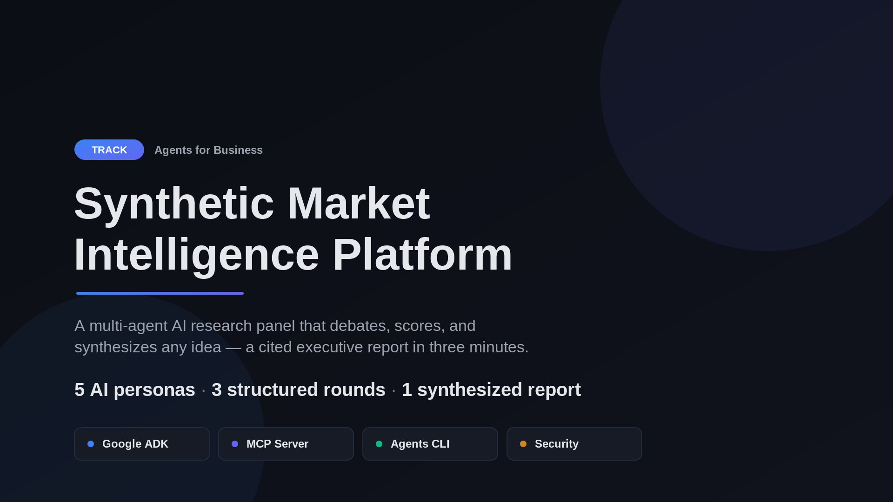
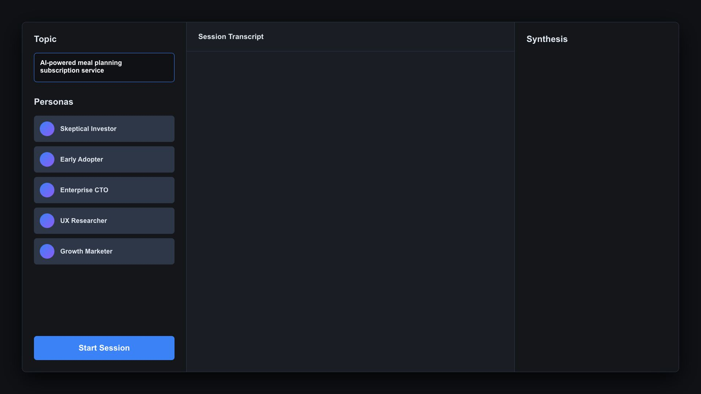
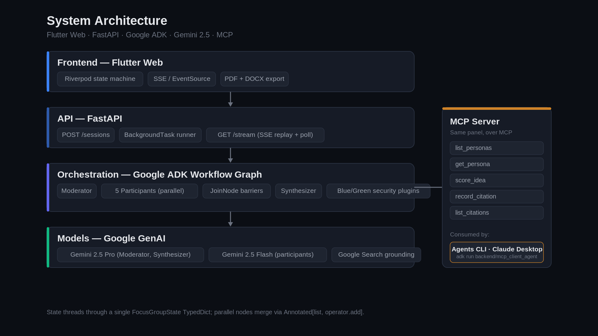
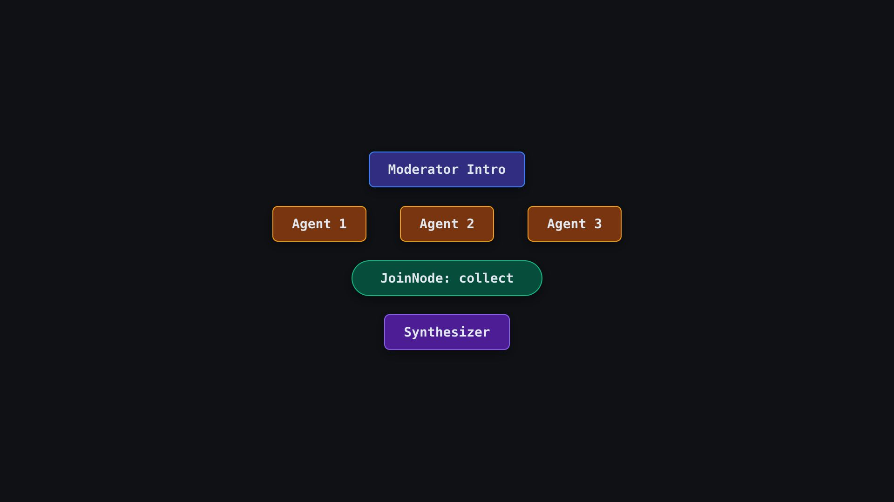
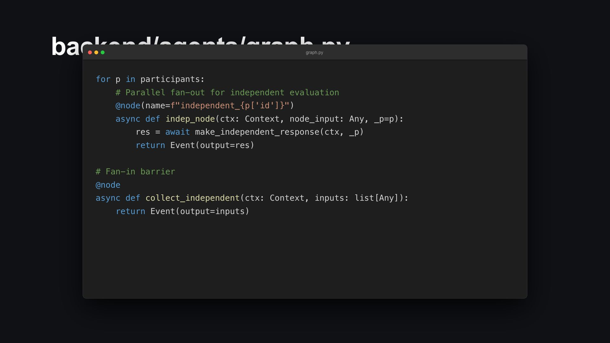
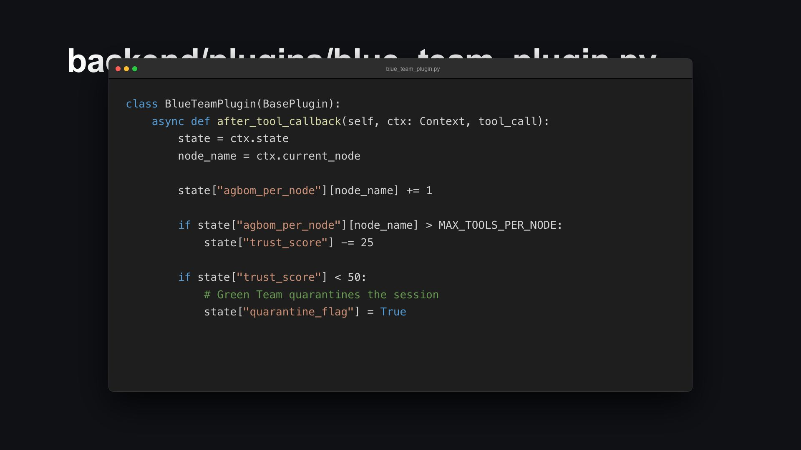

# Synthetic Market Intelligence Platform

### A multi-agent AI research panel that runs a structured, adversarial focus group on any idea — and returns a scored, cited executive report in under three minutes.

**Track:** Agents for Business



---

## The Problem: Business Feedback Is Broken

Every founder, product manager, and strategist has faced the same wall: you have an idea, and you need honest, multi-perspective feedback before you invest months of execution. The traditional options are uniformly painful.

Hiring a real focus group costs thousands of dollars and takes weeks to schedule. Asking colleagues produces polite agreement and survivorship bias — people who chose this company and this idea are unlikely to be its harshest critics. Posting to Reddit or Product Hunt invites only self-selected respondents with idiosyncratic views. And asking a single AI assistant gives you one synthetic opinion filtered through a single model's training distribution — useful as a sanity check, almost useless as a market signal.

The real problem is not a shortage of opinions. It is a shortage of *structured, diverse, adversarial* feedback delivered quickly and at zero marginal cost. Professional focus groups work because they are structured: participants react independently before hearing each other (preventing anchoring), a moderator surfaces disagreements and pushes on weak points, and final evaluations are collected blind (preventing social-desirability bias). That protocol is what makes qualitative research valuable. The cost and time are just friction that most teams cannot absorb.

The question this project asked was: what if we could instantiate that protocol in software — replacing human participants with AI agents that each have a distinct perspective, known biases, hidden motivations, and a specific scoring lens — and run the whole session in under three minutes?

## The Solution: A Synthetic Focus Group

The Synthetic Market Intelligence Platform is a multi-agent AI system that simulates a structured research panel. You submit any topic — a product concept, a pitch, a strategy, a feature idea — select up to five AI personas, and watch them debate it in real time. When they finish, you receive a synthesized executive report with weighted scores across six dimensions and grounded citations from live web search.


*The three-panel interface — pick a topic and up to five personas, then watch the session run and the synthesis build in real time.*

The key design insight is that the value is not in any single agent's opinion. It is in the structured *disagreement*. Marcus Chen, a Skeptical Investor, cares almost exclusively about monetization and market size (scoring weights of 2.0 and 1.5); he will find the fatal flaw in your unit economics that everyone else politely overlooked. Priya Sharma, a UX Researcher, will ask who the actual user is and whether they can use the product without a manual. Jordan Ellis, a Growth Marketer, will ignore both of them and ask what the distribution wedge is. These are not just different prompts — they are different agents with different temperature settings, different scoring-weight matrices, and different communication styles baked into their system prompts.

Running all five in sequence would collapse their responses into consensus, because each would react to what came before. So the platform mirrors real focus-group protocol: Round 1 responses are collected *in parallel*, before any agent sees the others. Only after all independent evaluations are in does a Moderator agent surface the disagreements and ask targeted follow-up questions. Then agents respond to each other. Then they vote privately. The order matters and is enforced by the workflow engine, not by prompting.

The output is not a chat log. It is a structured report: per-agent scores, category averages, standard deviations that quantify how much consensus exists, a synthesized executive summary, and specific action items. You can export it as a PDF or DOCX and take it into a board meeting.

## Course Concepts Demonstrated

The capstone asks for at least three course concepts. This project implements **four**, each verifiable in the codebase:

| Concept | Where it lives | Summary |
|---|---|---|
| **Multi-agent System (ADK)** | `backend/agents/graph.py` | A dynamically built Google ADK workflow graph with parallel fan-out and join barriers. |
| **MCP Server** | `backend/mcp_server/server.py` | A `FastMCP` server exposing the panel's personas, scoring, and citations over the Model Context Protocol. |
| **Agent Skills / Agents CLI** | `backend/mcp_client_agent/` | A minimal ADK agent that consumes the MCP server as a client, driven from the terminal via `adk run`. |
| **Security Features** | `backend/plugins/` | Blue Team / Green Team ADK plugins that monitor tool usage and quarantine drifting sessions. |

## Architecture

**Stack.** The backend is Python 3.11 with FastAPI and Google ADK (`>=2.0.0`). The workflow is orchestrated entirely through the ADK graph API. LLM calls go through the Google GenAI SDK — Gemini 2.5 Pro for the Moderator and Synthesizer (which require deeper reasoning and synthesis), and Gemini 2.5 Flash for the five participant agents (where speed and persona distinctiveness matter more than raw capability). The frontend is Flutter Web with Riverpod state management, consuming a Server-Sent Events stream via the browser's native `EventSource` API.


*The stack end to end. The same ADK panel is also published over MCP (right), reachable from the Agents CLI or Claude Desktop.*

### The ADK Workflow Graph

The core of the system is an ADK `Workflow` built dynamically in `backend/agents/graph.py`. The graph structure encodes the focus-group protocol as a topology of sequential and parallel nodes:

```
moderator_introduce
    → [independent_eval × N]   (parallel fan-out)
    → collect_independent      (JoinNode barrier)
    → moderator_followup
    → [discussion × N]         (parallel fan-out)
    → collect_discussion       (JoinNode barrier)
    → [vote × N]               (parallel fan-out)
    → collect_votes            (JoinNode barrier)
    → synthesizer
```


*Each round fans out to parallel per-persona nodes and reconverges at a JoinNode barrier before the next phase can begin.*

Each fan-out spawns one ADK node per selected persona. The `JoinNode` barriers enforce the protocol: no agent can see Round 2 questions until every Round 1 response is collected. This is not just a logical constraint — it is structurally impossible to bypass at the graph level, which means no prompt-engineering accident can accidentally expose early responses and contaminate the independent evaluation.

The `build_graph` factory accepts a list of `AgentPersona` TypedDicts and generates node identifiers dynamically (e.g. `independent_skeptical_investor`, `vote_ux_researcher`). Adding a new persona requires only a new entry in the persona registry — the graph topology wires itself.


*The runtime fan-out in `graph.py`: one `@node` per participant, then a fan-in barrier that collects every response before the workflow advances.*

### State Threading

All session data flows through a single `FocusGroupState` TypedDict, threaded through the workflow via the ADK state mechanism. The fields that accumulate across nodes (stream events, citations, independent responses, discussion responses, and scores) use Python's `Annotated[list, operator.add]` pattern, which tells ADK to merge incoming lists additively rather than overwriting. This is what makes parallel fan-out safe: two participant nodes writing to `independent_responses` simultaneously have their outputs merged cleanly, with no race condition.

### Real-Time Streaming

Sessions run as FastAPI `BackgroundTask` instances. A `GET /sessions/{id}/stream` endpoint exposes an SSE generator that first replays all events already recorded (so a client that connects late or reconnects still sees the full history), then polls every 500 ms for new events until the session completes. The Flutter client uses the browser-native `EventSource` — not a polling client, not a WebSocket — because `EventSource` handles reconnection and text encoding correctly with no custom implementation.

The `SessionNotifier` (a Riverpod `Notifier`) on the frontend is a state machine that folds each incoming `StreamEvent` into the displayed session state. Agent messages, phase transitions, score updates, and the final report each advance distinct state fields, and the UI renders from this state reactively.

## Publishing the Panel Over MCP

The in-process ADK workflow is ideal for the bundled Flutter UI, but it locks the panel's capabilities inside a single Python process. To make the panel *composable* — reusable by external agents and hosts — the project ships a **Model Context Protocol server** in `backend/mcp_server/server.py`, built on `FastMCP`.

It exposes five tools (`list_personas`, `get_persona`, `score_idea`, `record_citation`, `list_citations`) and two resources (`panel://roster`, `persona://{persona_id}`). The critical design decision is a **single source of truth**: persona data is imported straight from `backend/agents/personas.py`, so the panel the frontend sees and the panel an MCP client sees can never drift apart. The `score_idea` tool reuses the exact weighted-scoring math of the in-workflow `vote` node, so an external client gets identical results.

Because an MCP client has no ADK session state, the standalone `record_citation` tool persists to an atomic JSON store instead of `tool_context.state` — while mirroring the same `{title, url, excerpt}` record shape used everywhere else. The server runs over stdio by default (what Claude Desktop and the Agents CLI expect) and over streamable HTTP with a `--http` flag.

### Driving It From the Agents CLI

The MCP server is not just consumable by Claude Desktop. `backend/mcp_client_agent/` is a minimal ADK agent that connects to the server as an MCP *client* (via `MCPToolset` over stdio) and is driven entirely from the terminal:

```bash
backend/.venv/bin/adk run backend/mcp_client_agent
```

`adk run` imports the agent directory, finds `root_agent`, and opens an interactive prompt. On the first tool call the agent spawns `python -m backend.mcp_server.server` as a stdio subprocess and lists its tools. Ask it to *"list the panel personas, then have Marcus Chen score an idea with innovation 8, market 6, ux 5, feasibility 7, monetization 4, risk 3"* and it calls `list_personas` then `score_idea` — the same scoring the internal ADK `vote` node uses, now reached through a standard CLI host with no UI in the loop. This is the Agent Skills / Agents CLI concept in practice: one capability surface, reachable from the bundled app, from Claude Desktop, or from the command line.

## Agent Security: Blue Team and Green Team Plugins

One of the more interesting engineering decisions was building explicit safety controls directly into the workflow as ADK `BasePlugin` subclasses rather than as prompting constraints.


*The trust-score logic (simplified for illustration): tool calls are logged per node, over-limit nodes lose trust, and a low score trips the Green Team quarantine flag.*

The `BlueTeamAnalyticsPlugin` runs an `after_tool_callback` on every tool call across all nodes. It maintains an Agent Bill of Materials (AGBOM) — a per-node log of every tool invoked — and computes a session-level Trust Score starting at 100. If any single workflow node exceeds ten tool calls (a threshold that indicates potential Intent Drift, where an agent is doing far more than its role requires), the plugin deducts 25 points and emits a warning.

The `GreenTeamQuarantinePlugin` runs a `before_tool_callback`. When the Trust Score falls below 50 — meaning two or more nodes have drifted — it raises a `RuntimeError` that halts all further tool execution while preserving the full session state in memory for forensic analysis. The session does not corrupt itself trying to continue; it freezes cleanly.

This was a deliberate design choice: safety as infrastructure, not as a prompt. Prompt-level instructions ("don't call too many tools") can drift or be ignored under the right conditions. Plugin-level enforcement is deterministic.

## Citations and Grounding

Every agent that makes a factual claim — market-size figures, competitor information, technical standards — has access to two tools: Google Search (for live web retrieval) and `url_context` (for reading specific URLs). A third tool, `record_citation_tool`, is a lightweight ADK `FunctionTool` that appends `{title, url, excerpt}` records to shared session state. The Synthesizer reads these citations and includes them in the final report, and the Flutter client surfaces them as a scrollable citation list.

Grounding was added late in development and had a meaningful qualitative impact: without it, agents made confident claims about market size and competitive landscape that were plausible but unverifiable. With it, the Synthesizer can say "according to [source], the addressable market is estimated at $X" rather than generating a number from training weights.

## Report Export

Once a session completes, the user can export the full report as PDF or DOCX. Both builders run entirely client-side in the browser — `pdf_builder.dart` using the `pdf` and `printing` packages, `docx_builder.dart` using hand-rolled OOXML zipped with the `archive` package. No server-side generation, no stored files. Doing this client-side avoids storing generated documents on the server and eliminates a whole class of async job-management complexity.

## Fit for "Agents for Business"

This project fits the Agents for Business track because it addresses a concrete business workflow — qualitative market research and idea validation — that is expensive, slow, and inconsistent in its current form, and replaces it with a reproducible, structured, multi-agent process that produces exportable deliverables in minutes.

The agents are not chatting. They are executing a defined protocol: independent evaluation, moderated follow-up, open discussion, blind voting, executive synthesis. That protocol encodes decades of qualitative-research methodology. The software makes it instantiable on demand, at zero marginal cost per session, with a full audit trail of every agent action and a trust-monitoring system that detects when something goes wrong.

The system works today. Give it a pitch-deck concept and three minutes later you have a structured report with a viability score, a consensus confidence interval, identified strengths and risks, specific action items, and cited sources. That is a business output, not a demo.

## What Is Next

The most obvious extension is session persistence and comparison — running the same topic through the same panel at different points in time to track how consensus shifts as the market develops. A second direction is custom persona configuration: letting users define their own panel members with specific domains, biases, and scoring weights rather than selecting from the built-in five. A third is vertical specialization — a healthcare panel (regulatory expert, clinician, patient advocate, payer), a consumer-hardware panel, an enterprise-SaaS panel — where the personas encode domain knowledge the generic panel lacks.

Because the underlying ADK workflow graph is already parameterized by persona list, and the MCP server derives its surface from that same registry, all three of these are additive changes that do not require restructuring the core architecture.
